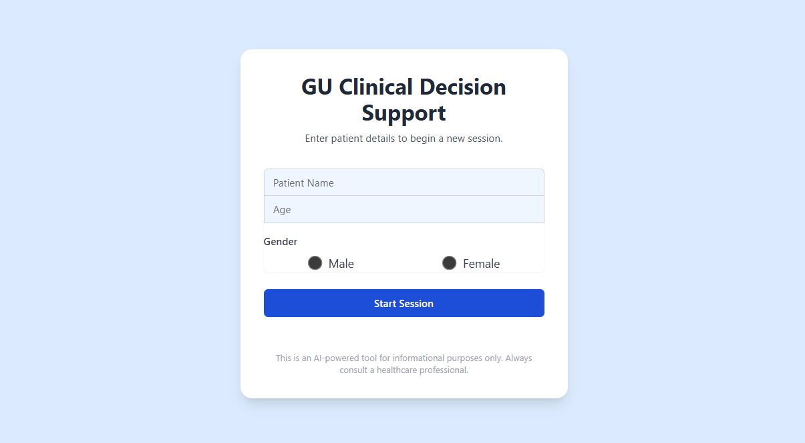

     

📘 1. What This App Does

The GU-CDSS is a clinical AI system that assists healthcare providers in evaluating male and female genito-urinary symptoms using:

📚 Standardized Syndromic Algorithms

📄 PDF-Extracted Knowledge Bank (NACO Guidelines)

🤖 Google Gemini AI Reasoning

🧠 Rule-Based Clinical Flowcharts

It helps clinicians quickly determine:

✔ Likely syndrome
✔ Required history questions
✔ Identifying danger signs
✔ Recommended first-line management
✔ Referral criteria

🖥️ 2. App Screenshots
✨ Home / Landing Page

✨ Chat Interface / Clinical Reasoning Flow

🚀 3. How to Use the Application (Step-by-Step)

This section explains EXACTLY how a user can interact with the GU-CDSS app.

Step 1 — Open the App

Click the application link hosted on Google AI Studio App Builder:

👉 https://aistudio.google.com/app/YOUR-APP-ID

You will reach the Home / Landing Page.

Step 2 — Select Symptom Category

Choose from the available options:

Female genito-urinary complaints

Male genito-urinary complaints

Urethral discharge

Vaginal discharge

Burning micturition

Scrotal swelling

Genital ulcers

Urine changes (polyuria, haematuria, oliguria)

Step 3 — Start the AI Chat

Once inside the chatbot interface:

The AI asks standard clinical questions

You respond with patient symptoms

The app applies decision trees + guideline logic

It identifies the most probable syndrome

Step 4 — Review the Recommendations

The system will show:

🎯 Syndrome classification

🚨 Red-flag signs

💊 First-line recommended treatment

👩‍⚕️ When to refer immediately

🔍 Clinical reasoning behind decisions

Step 5 — Try Example Inputs
Female Case Example
25-year-old woman with itching and curdy white discharge.

Male Case Example
22-year-old male with burning urination and yellow discharge.

PID Case Example
28-year-old female with fever, pelvic pain, and foul-smelling discharge.

📂 4. Repository Structure
/
├── algorithms/         ← Clinical decision flowcharts (PDFs)
├── knowledge-bank/     ← NACO guideline PDFs (P-GU-001 to P-GU-009)
├── screenshots/        ← Images shown in README
└── README.md

📚 5. Knowledge Bank Summary (Visually Explained)

The Knowledge Bank consolidates ALL GU-related syndromes into a structured reference set used by the AI.

🩺 Female Syndromes
Syndrome	Short Description	File
Cervicitis	Mucopurulent discharge, cervical inflammation	P-GU-001
Dysmenorrhea	Cramping pelvic pain during menstruation	P-GU-002
Genital Ulcer Disease	Painful/painless ulcers with/without lymph nodes	P-GU-003
PID	Pelvic pain, fever, cervical motion tenderness	P-GU-005
Vaginitis	Curdy, frothy, or foul-smelling discharge	P-GU-009
UTI	Dysuria, frequency, urgency	P-GU-008
🧔 Male Syndromes
Syndrome	Short Description	File
Urethritis	Burning urination + urethral discharge	P-GU-007
Epididymitis	Painful scrotal swelling	P-GU-006
Genital Ulcers	HSV, syphilis, chancroid, LGV	P-GU-003
Urinary Symptoms	Burning, retention, haematuria	Algorithms
Scrotal Swelling	Hernia vs torsion vs infection	Algorithms
🔀 6. Algorithms Overview (Visually Structured)

The CDSS uses syndromic decision trees based on national guidelines.

📊 Algorithm Categories
Algorithm Category	What It Helps Identify
Genital Redness/Swelling	Infection vs fungal vs trauma
Urinary Complaints (M/F)	UTI, stones, diabetes, carcinoma
Genital Ulcer Flowchart	HSV, syphilis, chancroid, LGV
Vaginal Discharge Flow	Candida, BV, Trichomonas
Scrotal Swelling	Torsion, hernia, epididymitis
Vaginal Bleeding	DUB, pregnancy issues, cervical changes
Inguinal Bubo	LGV vs TB lymphadenitis
Referral Algorithm	Danger signs requiring urgent care
🧩 Visual Logic (Simplified)
Symptom → Key Questions → Physical Findings → Algorithm Decision Node
       → Syndrome Output → Treatment Guidance → Referral Criteria

🏗️ 7. Technology Stack
Component	Technology
AI Engine	Google Gemini
Interface	Google AI Studio App Builder
Knowledge Base	Structured PDF extraction
Clinical Logic	Rule-based decision trees
Repository	GitHub
🎯 8. Future Enhancements
Planned Feature	Benefit
EMR Integration	Auto-saving clinical notes
QR-Code Patient Entry	Faster OPD workflow
Auto Summary Generation	Case documentation
Regional Languages	Broader accessibility
Voice Input	Hands-free clinical use
👩‍⚕️ 9. Developer
👤 Dr. Vaishnavi K R

PGDM – Artificial Intelligence & Data Science (Healthcare)
Specialization in: Clinical AI • Digital Health • Medical Informatics

⭐ If this project helped you, please give it a star!

It supports healthcare-focused AI development.

